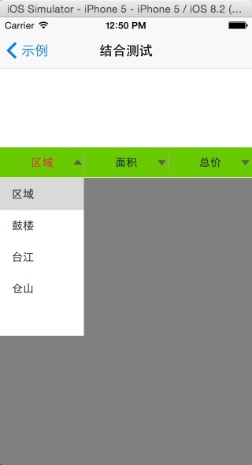

# CJPopup
弹出视图(包含类似美团的弹出下拉控件CJPDropDownView)

## 目录
1、 CJPopoverView
a pop view 一个带箭号的弹出视图

2、CJPDropDownView
弹出视图(包含类似美团的弹出下拉控件CJPDropDownView)


## Screenshots




## How to use
- ①、CJPDropDownView的完整控件使用
```
初始化如下：
- (void)viewDidLoad {
    [super viewDidLoad];
    // Do any additional setup after loading the view from its nib.

    DropDownRadioButtons *ddview = [[DropDownRadioButtons alloc]initWithFrame:CGRectMake(0, 164, self.view.frame.size.width, 40)];
    ddview.datas = @[
                     @[@"区域", @"鼓楼", @"台江", @"仓山"],
                     @[@"面积", @"75平米以下", @"75-100平米", @"100-150平米", @"150平米以上"],
                     @[@"总价", @"80万以下", @"80-120万", @"120-200万", @"200万以上"]
                    ];
    ddview.delegate = self;
    [self.view addSubview:ddview];
}


点击时候会调用如下委托：
- (void)ddRadioButtons:(DropDownRadioButtons *)ddRadioButtons didSelectText:(NSString *)text{
    NSLog(@"text3 = %@", text);
}

```


- ②、RadioButtons的使用
```
初始化如下：
    CGRect rect_radioButtons222 = CGRectMake(0, 264, self.view.frame.size.width, 40);
    commonRadioButtons222 = [[RadioButtons alloc]initWithFrame:rect_radioButtons222];
    [commonRadioButtons222 setTitles:@[@"人物", @"爱好", @"其他", @"地区"] radioButtonNidName:@"RadioButton_DropDown"];
    commonRadioButtons222.delegate = self;
    commonRadioButtons222.tag = 222;
    [self.view addSubview:commonRadioButtons222];

点击时候会调用如下委托：
- (void)radioButtons:(RadioButtons *)radioButtons chooseIndex:(NSInteger)index{

}
```

- ③、TableViewArraySingle的使用
```
初始化如下：
    NSArray *chooseArray = @[@"区域", @"鼓楼", @"台江", @"仓山"];

    TableViewArraySingle *customView = [[TableViewArraySingle alloc]initWithFrame:CGRectZero];
    [customView setFrame:CGRectMake(self.view.frame.size.width*2/4, 0, self.view.frame.size.width/4, 200)];
    customView.datas = chooseArray;
    [customView setDelegate:self];
    customView.tag = radioButtons.tag;

从radioButtons中弹出的方法如下：
    [radioButtons showDropDownExtendView:customView inView:self.view complete:nil];

选择TableViewArraySingle中的内容时候会调用下面的委托：
- (void)tv_ArraySingle:(TableViewArraySingle *)tv_ArraySingle didSelectText:(NSString *)text{
    NSLog(@"text2 = %@", text);

    //通过tag，反取到弹出该视图的RadioButtons
    NSInteger tag = tv_ArraySingle.tag;
    RadioButtons *comRadioButtons = nil;
    if (tag == commonRadioButtons111.tag) {
        comRadioButtons = commonRadioButtons111;
    }else if (tag == commonRadioButtons222.tag){
        comRadioButtons = commonRadioButtons222;
    }
    [comRadioButtons didSelectInExtendView:text];
}

```

- ①、TableViewsArrayDictionary的使用
```
初始化如下：
    NSArray *C_0_data = @[
                         @{kChooseArrayTitle:@"娱乐", kChooseArrayValue: @[@"爱旅行", @"爱唱歌", @"爱电影"]},
                         @{kChooseArrayTitle:@"学习", kChooseArrayValue: @[@"爱读书", @"爱看报", @"爱书法", @"爱其他"]},
                         @{kChooseArrayTitle:@"0", kChooseArrayValue: @[@"0-0", @"0-1", @"0-2", @"0-3"]},
                         @{kChooseArrayTitle:@"1", kChooseArrayValue: @[@"1-1", @"1-2", @"1-3"]}
                        ];
    NSArray *dic_chooseArray = @[
                                 @{kAD_Title: kChooseArrayTitle, kAD_Value: kChooseArrayValue}
                                ];

    ArrayDictonaryModel *adModel = [[ArrayDictonaryModel alloc]initWithC_0_data:C_0_data dicArray:dic_chooseArray];
    [adModel updateSelecteds_index:@[@"0", @"0"]];

    TableViewsArrayDictionary *customView = [[TableViewsArrayDictionary alloc]initWithFrame:CGRectZero];
    [customView setFrame:CGRectMake(0, 0, self.view.frame.size.width, 200)];
    customView.adModel = adModel;
    [customView setDelegate:self];
    customView.tag = radioButtons.tag;
从radioButtons中弹出的方法如下：
    [radioButtons showDropDownExtendView:customView inView:self.view complete:nil];


选择TableViewsArrayDictionary中的内容时候会调用下面的委托：
- (void)tv_ArrayDictionary:(TableViewsArrayDictionary *)tv_ArrayDictionary didSelectText:(NSString *)text{
    NSLog(@"text1 = %@, %@", text, tv_ArrayDictionary.adModel.selecteds_titles);

    //通过tag，反取到弹出该视图的RadioButtons
    NSInteger tag = tv_ArrayDictionary.tag;
    RadioButtons *comRadioButtons = nil;
    if (tag == commonRadioButtons111.tag) {
        comRadioButtons = commonRadioButtons111;
    }else if (tag == commonRadioButtons222.tag){
        comRadioButtons = commonRadioButtons222;
    }
    [comRadioButtons didSelectInExtendView:text];

}
```


### CJPopoverView
a pop view 一个带箭号的弹出视图

#### Screenshots
<!---->


